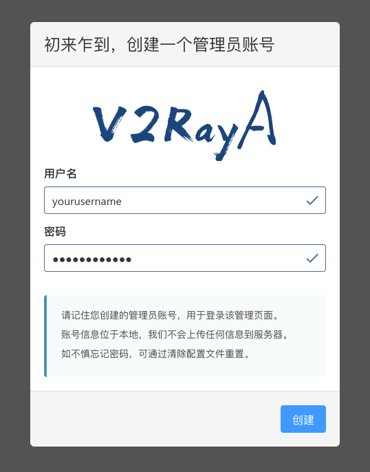
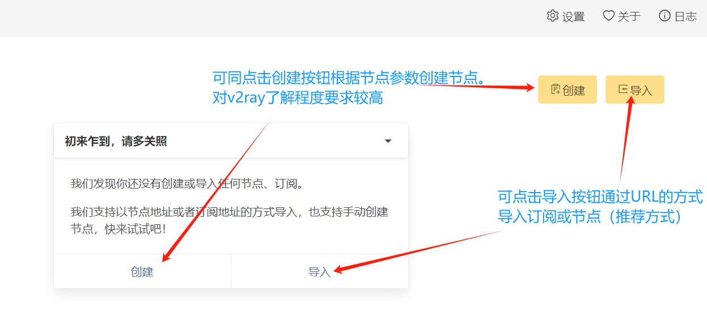
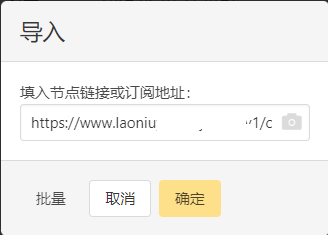
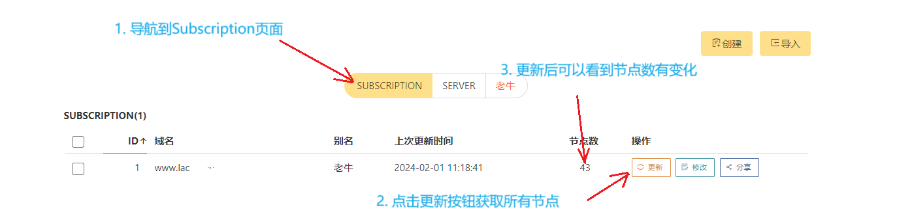
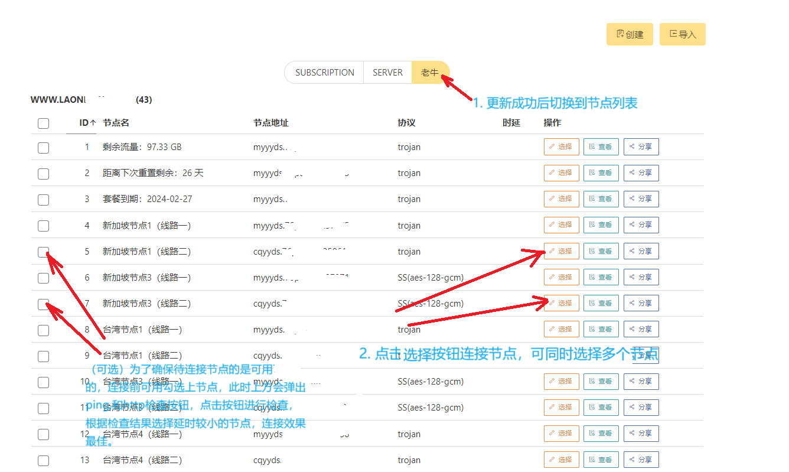
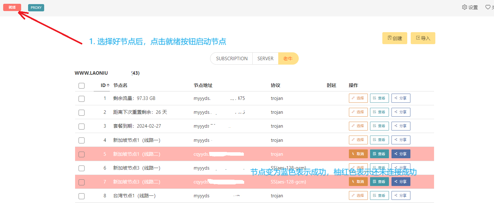
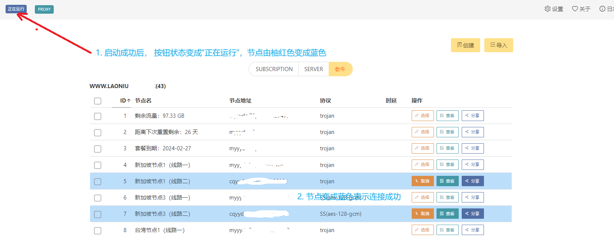
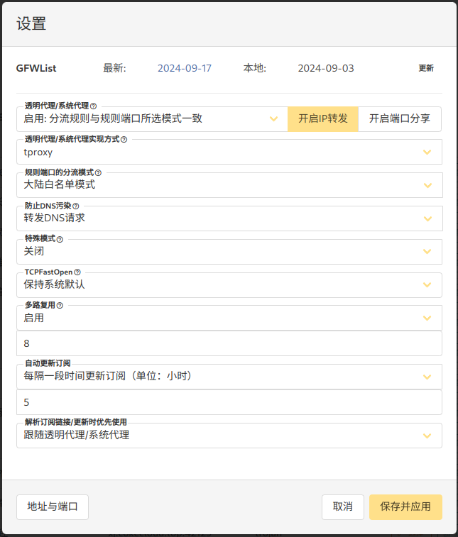

如何使用 v2rayA？ 链接：https://pengtech.net/network/v2rayA_install.html
使用 v2rayA 分为以下步骤：

首先通过 v2rayA web 管理界面创建一个用于管理 v2rayA 的账号;
然后从机场服务商那里获得订阅，并导入订阅;
最后连接并启动节点。
完成这些即可畅通无阻的访问外网了。

4.1. 登陆 v2rayA web 管理界面
在浏览器中打开 v2rayA web 管理界面 http://localhost:2017/

说明：

如果 v2rayA 正常启动（启动有时需要等待几分钟）则会监听在 2017 端口，在所有操作系统上 v2rayA 管理方式都是一致的， 都是通过 WEB 界面进行管理。

许多服务器是没有安装 Linux 桌面的，无法在主机上使用浏览器进行访问，此时需要远程管理 v2raya，开启远程管理参考本文 进阶用法 -> 开启远程管理章节。

Macos 上不要用 safari 浏览器打开可换其它浏览器,例如使用 chrome 打开，v2rayA GUI 对 safari 支持不太好，可能会出现白屏的情况。

4.2. 创建管理账号

在第一次进入页面时，你需要创建一个管理员账号，请妥善保管你的用户名密码。

如果遗忘，可以使用 sudo v2raya --reset-password 命令重置密码, 重置前先停止 v2raya，详细用法请查看 Troubleshooting - 问题 2。

4.3. 获取机场订阅 url
可以从如下机场服务商列表中获取订阅或节点。

 机 场 服 务 商 列 表   (click me)

从以上机场服务商列表， 选择一个机场服务商，然后注册账号，购买订阅，通常在“仪表盘 -> 一键订阅”可以获取到订阅 url。

说明：

如果要使用 ChatGPT, 需要注意以下两点
a) 选择机场服务提供商时选择支持 ChatGPT 的服务提供商例如: 稳联云，这种资源目前非常稀缺，实测以上机场服务商列表中“稳联云”的多数节点(截至 2024-10-29)支持得很好。

b) v2ray web 设置 =》透明代理/系统代理实现方式 =》需要设置为 tproxy（透明代理） 参考章节 4.7. 检查设置。

4.4. 导入订阅 url 或 节点 url
根据前面指引获取到订阅 url 后，就可以导入订阅了，详细步骤参考以下截图。

点击导入按钮进入订阅或节点导入界面，推荐使用导入订阅的方式，比较简单方便。

一个订阅下有若干个节点，也可以选择逐个导入一个或多个节点。另外如果是自建服务器，一般不会有订阅 url, 此时可以选择以节点方式导入。

导入订阅如下图所示：

订阅 URL 类似这样子: https://xxx.xxxx.com/api_version2/xxxxxxxx?sub=3&extend=1

4.5. 连接节点
一个订阅多数情况下会包含多个分布在全球各地的不同节点，一旦订阅成功导入就会自动获取到相应的节点信息。

管理界面介绍可以参考 6.3. v2rayA 的管理界面介绍。

导入订阅 url 后，会看到，节点数量，另外会看到右侧多了一个节点列表标签页。通常在订阅 url 格式正确，订阅没有过期的情况下，我们可以看到节点数量，如果发现节点数量为 0 或很少，可以手动点击更新进行更新。

切换到节点列表标签页，点击相应节点后面的“连接”按钮，可同时连接一个或多个节点，这也是 v2ray 和 V2rayA 与其他代理上网方式相比强大的地方。

说明：

虽然可以同时连接多个节点，但是这里不建议选择过多的节点，6 个以内为佳。

如果没有自动获取到节点信息，则可以手动点击订阅右侧的更新按钮，获取节点信息。另外在使用过程中如果节点出现 Timeout 和 not stable，某些情况下可能是节点配置已经过期，此时也可以使用更新按钮更新节点信息，以获得最新的节点配置。在设置界面有“自动更新订阅”，设置好合适的更新间隔，以保持节点设置始终处于最新状态。

4.6. 启动节点
导航到 SERVER 或订阅节点列表页，选择一个或多个节点后，启动该服务器。

连接成功后节点变为蓝色，如下图所示：

技巧与提示：

步骤 1，勾选一个或多个节点，此时界面上会出现 Ping 和 HTTP 按钮，点击相应按钮测试服务器 ping 值，以及 http 延时，以便快速找到可用节点。

步骤 2， 选择节点，在每个节点右侧有一个选择按钮，点击选择按钮选中节点，此时节点呈现柚红色，因为还未启动它们。

步骤 3，在页面左上角有个“就绪”按钮点击该按钮启动节点，节点呈现蓝色表示启动成功。

如果未呈现蓝色即未启动成功，请点击页面右上角点击日志查看问题详情。

另外查看评论区网友遇到过的问题，或许对一些疑难杂症会有所帮助。

节点呈现蓝色是能成功连接外网的基本要求，也即如果不是蓝色肯定连接不了外网，节点呈现蓝色后，还要检查其他要求包括：Ping 值是否正常 和 HTTP 延迟是否正常，设置是否合理等。

4.7. 检查设置
有时候节点已经正常启动已经呈现蓝色，但是仍然不能正常访问某些网站，这可能与具体设置有关系。
此时可以参照下图推荐的设置进行调整，基本能成功访问。

如果仍然有不能成功访问外网，可以查看一下日志信息，看是否有错误信息。
详细的错误日志可以点击网页上的日志按钮查看, 也可以在/var/log/v2raya/下面可以找到日志。

有时会因为缓存原因，设置修改后不会立即生效，这时可以重启一下网卡，或者重启一下 v2rayA 服务。

说明：

如何理解这里的配置选项？

首先了解端口分流规则。
什么是分流规则？

要讲清楚V2Ray的分流规则，需要非常长的篇幅， 这里我们将其进行简化， 虽然不够准确但是对于快速理解分流规则会有帮助，
所谓的分流就是V2Ray捕获到我们的数据请求以后，判断是应该走直连（direct）还是走代理(代理)。毕竟不是所有的网站都被墙了，所以对于没有被墙的网站直连依然是有效的访问方式。被墙的网站当然需要走代理，有些网站对于IP的地域是有限制的， 比如一些流媒体网站，这些网站也只能通过代理才能正常访问，另外出于自身隐私保护的需求，不想将自己真实的ip地址暴露给被访问网站，那么也需要通过代理访问。所以需要定义一些规则来满足不同的访问需求。

为什么叫端口分流规则，这里的端口是什么意思？

这是因为V2rayA不仅仅可以作为客户端代理本机的数据请求，它还可以作为代理服务器为局域网内的其他设备提供代理。当它作为代理服务器时，它监听在特定端口，例如v2rayA作为http代理，默认监听在20171和20172端口，作为socks代理默认监听在20170端口。针对不同端口来的数据请求，可以配置不同的规则，所以叫端口分流规则。当V2rayA作为客户端时，不涉及到端口，所有的请求都会经过分流规则， 具体规则是由”透明代理/系统代理“规则决定的。

v2rayA 是对 v2ray(内核)的一层包装，v2ray 的分流规则非常强大且灵活， 非专业人士很难理解这些规则。

v2rayA 在 v2ray 的复杂的分流规则的基础上，抽象出了两套基本规则，一套是大陆白名单模式，一套是GFWList模式，这两套预定义的规则基本能满足90%的科学上网需求，

如果需要更复杂的分流规则，v2rayA保留了v2ray 的routingA规则，几乎和v2ray的规则完全匹配，这样既简化了配置，又保持了v2ray的强大与灵活性。

大陆白名单模式 和 GFWList模式的主要差别是，GFWList模式仅根据被墙的域名名单判断应该走proxy（代理）还是 direct（直连）

大陆白名单模式会根据域名对应的ip获取到地域属性，如果是CN(中国)则直连，否则都走代理。所以使用v2rayA需要两个文件，一个是geosite.dat一个是geoip.dat这两个文件，用于判断域名是否在白名单和获取IP的地域属性。

两套规则各有优劣，GFWList模式的优势是性能稍好，它少一次域名解析的过程和一次提取地域属性的运算，性能上有些优势，它的劣势是使用者在访问国外网站时，不知道自己使用的是代理还是直连， 也即不确定自己的真实ip是否会暴露或者不确定自己的ip是否满足网站的地域要求，有时以为自己在使用代理实际是直连。

使用大陆白名单模式的优势是访问国外的网站统一使用代理， 国内则统一使用直连方式，不存在代理和直连混淆的状况， 但是由于多一次域名解析， 可能存在dns泄漏的问题， 所以在dns配置时一定要选择合适的选项， 后面会讲到。

然后要了解透明代理/系统代理实现方式
如果说分流规则决定何时使用代理，那么本项设置就是决定使用什么样的代理。透明代理和系统代理都会将源ip修改为所使用的代理的ip, 而redirect则会保留请求的源 ip. 所以两者明显的差别是在访问外网时， 目标网站看到的ip地址不同，这点可以使用whoer.com来检测， 通过调整代理实现方式，切换节点来观察ip的变化。

当访问一些对ip所属地域有要求的网站时，可以通过调整代理实现方式来改变访问网站时的ip地址.

透明代理/系统代理 选项
这条是设定在何种情况下使用透明代理/系统代理， 也即v2rayA作为V2Ray客户端时的分流规则，具体含义可以参照端口分流规则。

防止 DNS 污染
其实不仅仅是防止dns污染，如果分流和代理模式选择了大陆白名单时， 还要防止dns泄漏，关于什么是dns泄漏 以及dns污染，可以自行科普。

如果在使用了大陆白名单模式时，最好使用转发DNS请求，这样DNS请求是通过代理解析的，而不是通过本机dns服务器解析，从而避免泄漏。

这点可以使用 https://ipleak.net/ 或 https://whoer.com/ 检测， 当使用tproxy或者system proxy时， 如果一些被墙的网站有来自china的解析结果时，表示有ip泄漏的风险。

其他选项比较容易理解，这里暂时不做过多解释。
5. 验证设置是否成功？
如果是 Linux 桌面, 可以打开浏览器访问https://www.google.com, 如果能成功访问则表示连接成功.

如果是在命令行下, 可以运行如下命令访问 google. 如果能看到从 google 传输过来的内容, 则表示成功.

1
2 # 使用命令访问google
3
4 curl https://www.google.com
5

至此在单台主机上已经可以科学上网了，下面是一些进阶用法，如有需要可以参考。